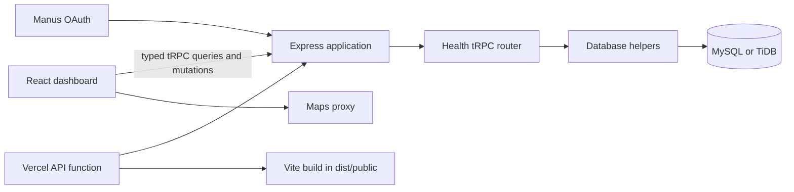

# LifeLink Blue

**LifeLink Blue** is a full-stack healthcare coordination demonstration application. It brings together blood-bank discovery, medicine availability, blood-reservation tracking, hospital-published transfusion and chemotherapy milestones, and caregiver coordination in a single clinical-dashboard experience.

> **Demonstration only.** This application contains representative data. It does not provide real-time clinical availability, diagnosis, treatment recommendations, or emergency services. Patients and caregivers must confirm clinical decisions, appointment details, and availability directly with the relevant provider.

## What the application includes

| Area | Included capability |
| --- | --- |
| Blood discovery | Searchable blood-bank inventory, blood-group filters, map markers, and external directions. |
| Medicine discovery | Persistent medicine catalog, availability records, source filters, and provider contacts. |
| Reservations | Blood reservation records with pending, accepted, and fulfilled lifecycle states. |
| Hospital care | Hospital-published transfusion and chemotherapy status records with lifecycle filters. |
| Caregiver network | Persisted caregiver profiles, consent links, shared updates, non-diagnostic coordination suggestions, and invitations. |
| Care journey | Patient-scoped trace from an accepted blood reservation to a treatment status, caregiver update, and caregiver suggestion. |
| Guided demonstration | A seven-step experience covering profile, discovery, reservation, blood-bank acceptance, and alerts. |
| Live dashboard | India local date/time, time-aware greeting, and current representative reservation, treatment, and caregiver summary cards. |

## Technology

| Layer | Implementation |
| --- | --- |
| Client | React 19, TypeScript, Vite, Tailwind CSS 4, React Query, Wouter, Lucide icons. |
| Server | Express 4 and tRPC 11 with typed procedures. |
| Database | MySQL/TiDB accessed through Drizzle ORM and generated SQL migrations. |
| Identity | Manus OAuth session integration. |
| Maps | Google Maps through the configured Maps proxy. |
| Validation | Vitest unit and integration-oriented tests. |
| Hosting | Managed LifeLink hosting, or Vercel with a Vite static build plus serverless API entry. |

## Architecture



The client accesses application data through typed tRPC hooks rather than raw browser requests. The server exposes the health router and data helpers; Drizzle persists the application model in MySQL/TiDB. Local development starts an Express listener, while Vercel imports the same application configuration through `api/index.ts` as a serverless handler.

## Patient-centered data model

`patientProfiles` is the care-model anchor. A patient profile can belong to one application user and is referenced by reservations, treatment statuses, and caregiver consent links. This allows the representative workflow to be traced from `LL-RSV-2026-001` through `LL-TX-2026-001` to a caregiver shared update and the **Confirm collection requirements** coordination prompt.

| Relationship | Purpose |
| --- | --- |
| `users → patientProfiles` | Links an authenticated user to one canonical patient profile. |
| `patientProfiles → bloodReservations` | Scopes each reservation to the patient. |
| `bloodReservations → hospitalTreatmentStatuses` | Optionally connects an accepted reservation to a transfusion status. |
| `patientProfiles → patientCaregiverLinks` | Records consent and sharing level for a trusted caregiver. |
| `patientCaregiverLinks → caregiverSharedUpdates` | Scopes provider and reservation updates to a care-sharing relationship. |
| `patientCaregiverLinks → caregiverSuggestions` | Scopes practical, non-diagnostic coordination suggestions. |
| `caregiverSharedUpdates` and `caregiverSuggestions → source records` | Maintains optional reservation, treatment, and medicine-availability provenance. |

The full entity-relationship diagram, foreign-key explanations, retention decisions, and workflow narrative are available in [`docs/database-relationships.md`](docs/database-relationships.md).

## Repository layout

```text
client/                 React dashboard and client-side utilities
  src/pages/Home.tsx    LifeLink dashboard views and interaction controller
  src/lib/              tRPC client, status view helpers, and focused tests
server/                 tRPC router and database helpers
  _core/app.ts          Reusable Express application configuration
  _core/index.ts        Local development and production listener
  routers/health.ts     Typed health-domain procedures
api/index.ts            Vercel serverless Express entry point
drizzle/                Schema, relations, and migrations
docs/                   Data-model and deployment documentation
vercel.json             Vercel static and API route configuration
```

## Local setup

Install Node.js 22 and pnpm, then install the project dependencies.

```bash
pnpm install --frozen-lockfile
```

Create your local environment through your secure secret-management workflow. Never commit credentials or database URLs to the repository.

| Variable | Purpose |
| --- | --- |
| `DATABASE_URL` | MySQL/TiDB connection string for Drizzle. |
| `JWT_SECRET` | Session signing secret. |
| `OAUTH_SERVER_URL` | OAuth service base URL. |
| `VITE_APP_ID` | Client OAuth application identifier. |
| `VITE_OAUTH_PORTAL_URL` | OAuth portal URL used by the frontend. |
| `OWNER_OPEN_ID`, `OWNER_NAME` | Project owner identity metadata. |
| `BUILT_IN_FORGE_API_URL`, `BUILT_IN_FORGE_API_KEY` | Server-side integrated service configuration, when used. |
| `VITE_FRONTEND_FORGE_API_URL`, `VITE_FRONTEND_FORGE_API_KEY` | Frontend integrated service configuration, when used. |

Start the application locally with the following command.

```bash
pnpm dev
```

## Database workflow

Schema changes are defined in [`drizzle/schema.ts`](drizzle/schema.ts). Generate a migration after modifying the schema, inspect the resulting SQL, and apply it using the appropriate controlled database workflow. Existing data must be backfilled before non-null foreign keys are enforced.

```bash
pnpm drizzle-kit generate
```

The database schema includes locations, medicine sources, medicines, medicine availability, blood banks, component inventory, reservations, hospitals, treatment statuses, patient profiles, caregiver profiles, patient-caregiver links, shared updates, suggestions, and contact details. Refer to the data-model documentation before changing relationships or deletion behavior.

## Quality checks

| Command | Purpose |
| --- | --- |
| `pnpm check` | TypeScript type validation. |
| `pnpm test` | Runs the Vitest suite. |
| `pnpm build` | Builds the Vite client and production Express bundle. |
| `pnpm dev` | Starts the local full-stack development server. |

The current automated coverage includes discovery queries, reservation and treatment lifecycle filters, caregiver network behavior, the care-journey trace, dashboard timeline utilities, and guided-demo controls.

## Deploying

### Managed hosting

The integrated managed hosting route is the simplest full-stack option because database access, OAuth, secrets, and project lifecycle controls are already connected. Create a project checkpoint and select **Publish** from the project interface.

### Vercel

LifeLink Blue includes a Vercel configuration that resolves the failure mode where backend JavaScript was served as page text. The configuration builds the Vite frontend into `dist/public`, sends `/api/*` to the Vercel serverless Express entry (`api/index.ts`), and routes browser navigation to the Vite entry page.

| Vercel setting | Value |
| --- | --- |
| Framework Preset | `Other` |
| Install Command | `pnpm install --frozen-lockfile` |
| Build Command | `pnpm build` |
| Output Directory | `dist/public` |
| Node.js | 22.x |

Configure the environment variables listed above in the Vercel project settings. Then update the OAuth redirect URL to `https://<your-vercel-domain>/api/oauth/callback` and redeploy. More detail is available in [`docs/vercel-deployment.md`](docs/vercel-deployment.md).

> A Vercel deployment needs a database that is reachable from Vercel and independent OAuth credentials. Do not use the development environment credentials in a production deployment.

## Privacy and clinical safeguards

The current public procedures support the representative unauthenticated demonstration. Before using real patient data, implement patient-scoped authorization, enforce caregiver consent and sharing levels, configure data-retention policies, add audit trails, and complete a privacy/security review appropriate for the deployment region.

Caregiver suggestions are intentionally practical prompts, such as confirming a collection requirement with a provider. They are not clinical diagnoses or treatment instructions.

## License

This project is currently distributed under the **MIT** license as declared in [`package.json`](package.json).
